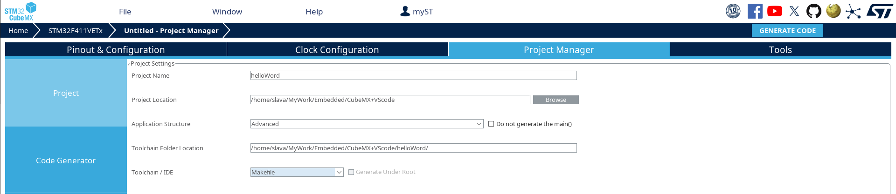
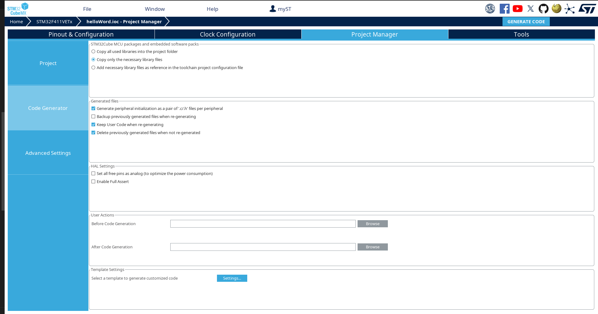

# CubeMX + openOCD + VSCode  

Это памятка по созданию среды разработки для микроконтроллеров семейства STM32 в дистрибутивах GNU Linux с использованием кодогенератора от ST CubeMX и OpenOCD в качестве ПО для программирования и отладки. Используемый дистрибутив - Manjaro Linux версии 23.1.1, отладочная плата STM32F411.

## Установка необходимого ПО для создания среды разработки  
Нам понадобиться установить менеджер пакетов yay:
```
pamac install yay
```

### CubeMX
Чтобы загрузить генератор кода CubeMX, введите в терминале следующую команду:
```
yay -S stm32cubemx
```
Или, если у вас возникли проблемы с установкой yay, то можно воспользоваться AUR.
```
git clone https://aur.archlinux.org/stm32cubemx.git
```

### GCC
Компилятор:
```
pamac install arm-none-eabi-gcc
```

### GDB
Отладчик:
```
pamac install arm-none-eabi-gdb
```

### openOCD
Загрузчик:
```
pamac install openocd
```

## Создание проекта в CubeMX
Самый простой способ получить заготовку проекта - собрать его в CubeMX. Процесс интуитивно понятный, сотни раз описанный в сети и данный текст про настройку среды разработки, а не работу в CubeMX. Сгонфигуриуем проект и добавим пин отладочного интерфейса для мигания светодиодом. Далее необходимо выполнить несколько обязательных пунктов:
- Во вкладке **Project** 
    - Необходимо выбрать в качестве *Toolchain / IDE* Makefile, это нужно для того, чтобы мы смогли собирать наш код в консоли без использования IDE.  
    

    - Также нам понадобится пакет прошивки для микроконтроллера STM32F4, его можно получить с официального репозитория, предоставляемого ST.  
    Ссылка на репозиторий, если вам хочется узнать больше информации:
        ```
        https://github.com/STMicroelectronics/STM32CubeF4
        ```

        Или вы можете сразу клонировать репозиторий:
        ```
        git clone --recursive https://github.com/STMicroelectronics/STM32CubeF4.git
        ```

        Для упрощения настройки проекта в CubeMX это можно сделать в расположение хранения по умолчанию:
        ```
        /home/<username>/STM32Cube/Repository/
        ```
        
        
        Если вы выбрали свое расположение хранения, то не забудьте снять галочку с *Use Default Firmware Location* и указать расположение прошивки.

- Во вкладке **Code Generator** рекомендуется, но не обязательно выбрать следующие 2 пункта:
    - *Copy only the necessary library files*. Это для того, чтобы добавлять в проект только необходимые библиотеки.
    - *Generate peripheral initialization as pair of '.c/.h' files per peripheral*. Это увеличит читаемость кода, т.к. каждый периферийный модуль микроконтроллера будет инициализироваться не в *main.c*, а в своем файле.
    

## Загрузка прошивки из консоли
В директории проекта должно находится примерно следующее:
```
Core  Drivers  helloWord.ioc  Makefile  startup_stm32f411xe.s  STM32F411VETx_FLASH.ld
```

Для проверки сгенерированного кода CubeMX-ом, добавим мигание светодиодом в *Core/Src/main.c*:
```C
/* USER CODE BEGIN WHILE */
  while (1)
  {
    HAL_GPIO_TogglePin(GPIOD, GPIO_PIN_13);
    HAL_Delay(500);
    /* USER CODE END WHILE */

    /* USER CODE BEGIN 3 */
  }  
``` 
Далее выполним сборку нашего проекта. Необходимо находится в директории, где расположен *MAkefile* и выполнить команду:
```
make all
```
Переходим в директорию *build* или указываем путь до *filename.elf* / *filename.hex* / *filename.bin* относительно того места, где мы находимся. 
- Для загрузки нашего проекта на микроконтроллер, представленного как *filename.elf* необходимо выполнить команду:
    ```
    openocd -f board/stm32f4discovery.cfg -c "program filename.elf verify reset exit"
    ```

- Для загрузки нашего проекта на микроконтроллер, представленного как *filename.hex* необходимо выполнить команду:
    ```
    openocd -f board/stm32f4discovery.cfg -c "program filename.hex verify reset exit"
    ```

- Для загрузки нашего проекта на микроконтроллер, представленного как *filename.bin* необходимо выполнить команду:
    ```
    openocd -f board/stm32f4discovery.cfg -c "program helloWord.bin exit 0x08000000 reset exit"
    ```       
