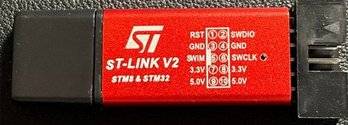
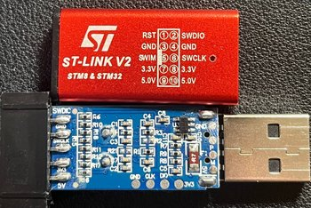
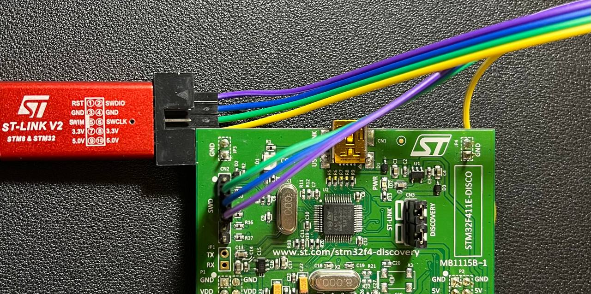
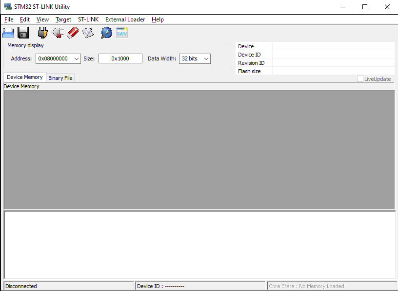
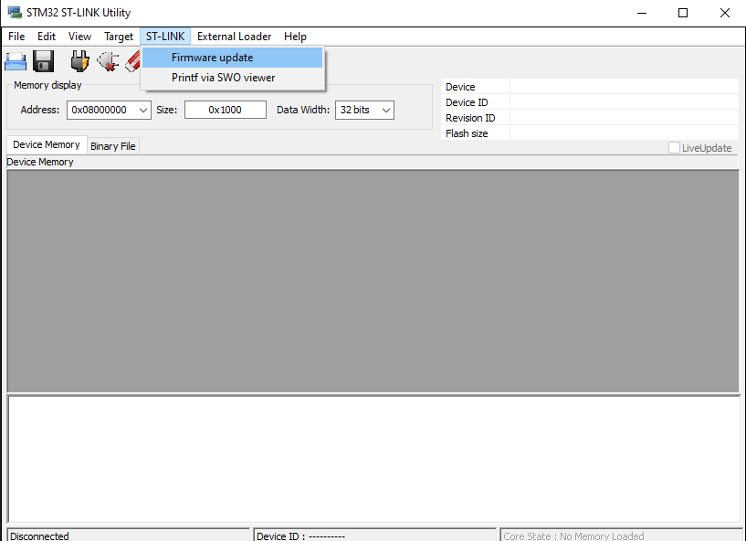
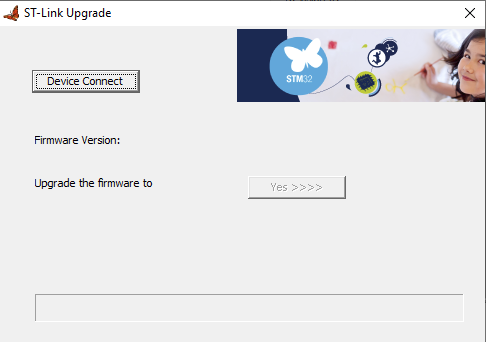
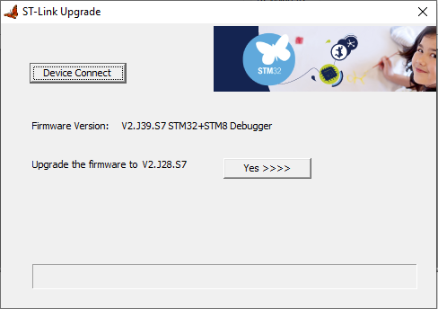
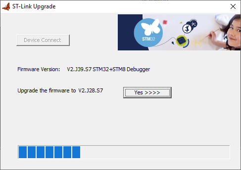
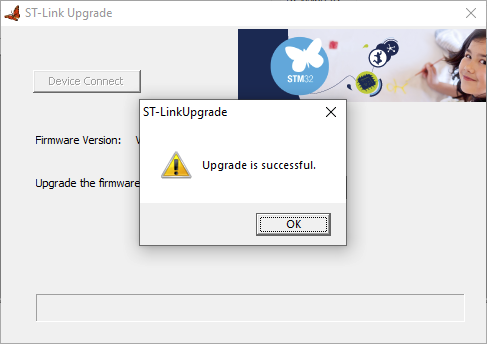

# Программаторы

Это памятка по восстановлению, устранению ошибок программаторов. Также рассматривается работа с ними.
Используемый дистрибутив - Manjaro Linux версии 23.1.1, отладочная плата STM32F4Discovery.

## Используемые наборы инструментов для программирования и отладки устройств и плат STM32
Для загрузки прошивки на отладочную плату используется набор инструментов *stlink*, для загрузки выполнить:
```
sudo pacman -Sy stlink
```
Более подробно с этим набором инструментов можно ознакомиться в репозитории [stlink](https://github.com/stlink-org/stlink/tree/testing).

## Обновление прошивки ST-Link

### ST-Link V2
ST-Link V2 представляет собой китайский клон ST-Link-а. Ниже приведено его фото:



Внутри программатора вместо оригинального контроллера STM32F103CBT6 стоит китайский клон - Geehy APM32F103CBT6: 


### Подключение ST-Link V2 к отладочной плате STM32F4Discovery
Проверку программатора ST-Link V2 для отладочной платы будем осуществлять путем использования проверяемого программатора в качестве внешнего загрузчика прошивки для отладочной платы STM32F4Discovery.

Рассмотрим схему подключения внешнего программатора к отладочной плате:\
На плате STM32F4Discovery имеется 6-контактный разъем swd для подключения внешних микроконтроллеров. Распиновка этого разъема на плате продемонстрирована ниже:


Внешний программатор ST-Link V2 имеет 10-контактный разъем IDC. Распиновку этого разъема можно найти на корпусе программатора. Но рекомендую снять корпус и проверить подписи разъемов на самой плате, так как встречаются программаторы у которых распиновка, напечатанная на корпусе, не соответствует действительности.



Так как данный программатор предназначен для работы с STM32 и STM8, то не все контакты нам понадобятся. Поэтому для работы с STM32 нам нужны пины:\
*SWDIO*, *GND*, *SWCLK*, *3.3V*.

Соединяем пины программатора с пинами 6-контактный разъем swd на отладочной плате следующим образом:\
*SWDIO* (2) -> *SWDIO* (4)\
*GND* ⠀ (4) -> *GND* ⠀ (3)\
*SWCLK* (6) -> *SWCLK* (2)\
*3.3V*⠀(10) -> *3V* (Подключается к пину *3V* для питания отладочной платы)

Ниже приведено фото для пояснения:




### Проблема
Для того, чтобы получить информацию о подключенном программаторе и целевом MCU введем в терминале команду:
```Console
st-info --probe
```
Результат команды:


Видим, что программатор не может получить информацию о микроконтроллере.\
Обратим внимание на версию прошивки - **V2J39S7**

### Обновление прошивки в ОС Windows

Для обновления прошивки ST-Link-а нам потребуется скачать и установить *STM32 ST-LINK utility*. Раньше последнюю версию ПО можно было найти на официальном сайте [STMicroelectronics](https://www.st.com/en/development-tools/stsw-link004.html). В качестве альтернативы официальному сайту можно использовать данный [сайт](https://stm32-st-link-utility.software.informer.com/versions/).

Скачайте приложение, запустите установщик и следуйте инструкциям на экране для установки программы.

Теперь, когда все необходимое ПО установлено, можно приступить к обновлению прошивки:

1. Запустите программу *STM32 ST-LINK utility* на вашем компьютере.

    

2.  Сверху в меню выберите **ST-LINK**, затем **Firmware update**

    

3. В появившемся всплывающем окне нажимаем на кнопку **Device Connect**

    

4. После того как произошло подключение к нашему программатору видим нашу версию прошивки в графе *Firmware Version* и в графе *Upgrade the firmware to* видим версию прошивки на которую можно обновить наш программатор.

    

5. Для загрузки прошивки нажимаем на кнопку **YES>>>>**. Наблюдаем процесс загрузки новой прошивки на нащ программатор.

    

    Процесс загрузки завершился успешно, нажимаем на **OK**

    

### Обновление прошивки в ОС Linux

### Результат 

Cнова получаем информацию о подключенном программаторе и целевом MCU введя в терминале команду:
```Console
st-info --probe
```
Результат команды:


Видим, что программатор получил информацию о микроконтроллере подключенном к нему.\
Обратим внимание на версию прошивки - **V2J28**. Та самая версия прошивки, которую мы установили с помощью программы *STM32 ST-LINK utility*.


## Доработка ST-Link v2: добавление интерфейса вывода отладочной информации SWO и ноги Reset

В этом разделе будет описана доработка китайского ST-Link v2. В него можно добавить вывод SWO для получения отладочной информации и пин управления Reset’ом для микроконтроллеров STM32 (аналогично выводу RST, который предназначен STM8).

### Проблема 

Используемый для отладки микроконтроллеров STM32 интерфейс SWD поддерживает передачу отладочной информации через вывод SWO в режиме реального времени. По умолчанию в китайском ST-Link v2 он отсутствует, что не дает нам использовать внутренний терминал и функцию printf().  

А вывод Reset нужен для того, чтобы программно использовать Reset, а не нажимать кнопку Reset руками на отладочной плате.


Распайка - https://habr.com/ru/articles/402927/
Проблема отсутсвия swo - https://habr.com/ru/articles/749474/

## Перепрошивка ST-Link V2 в ST-LinkV2.1

https://github.com/GMMan/st-link-hack


## Перепрошивка ST-Link в J-link

