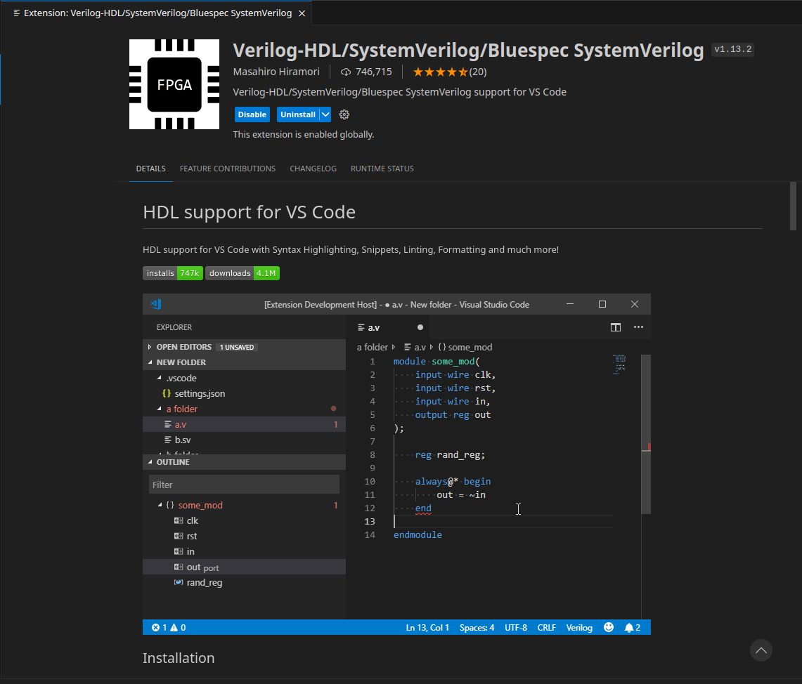
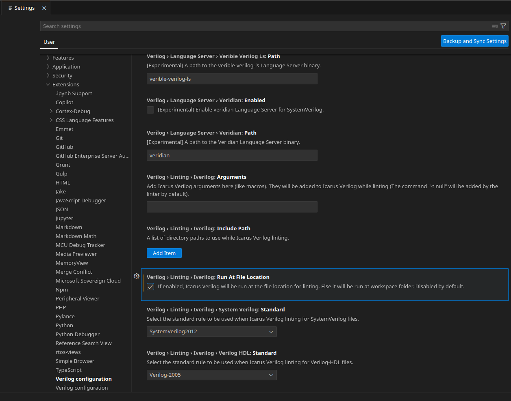
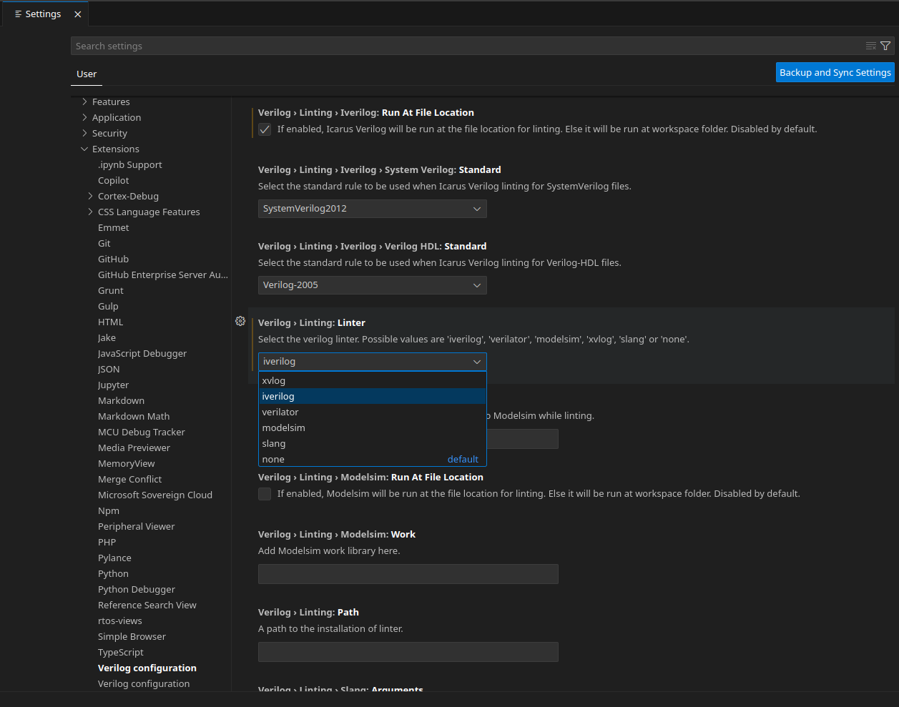
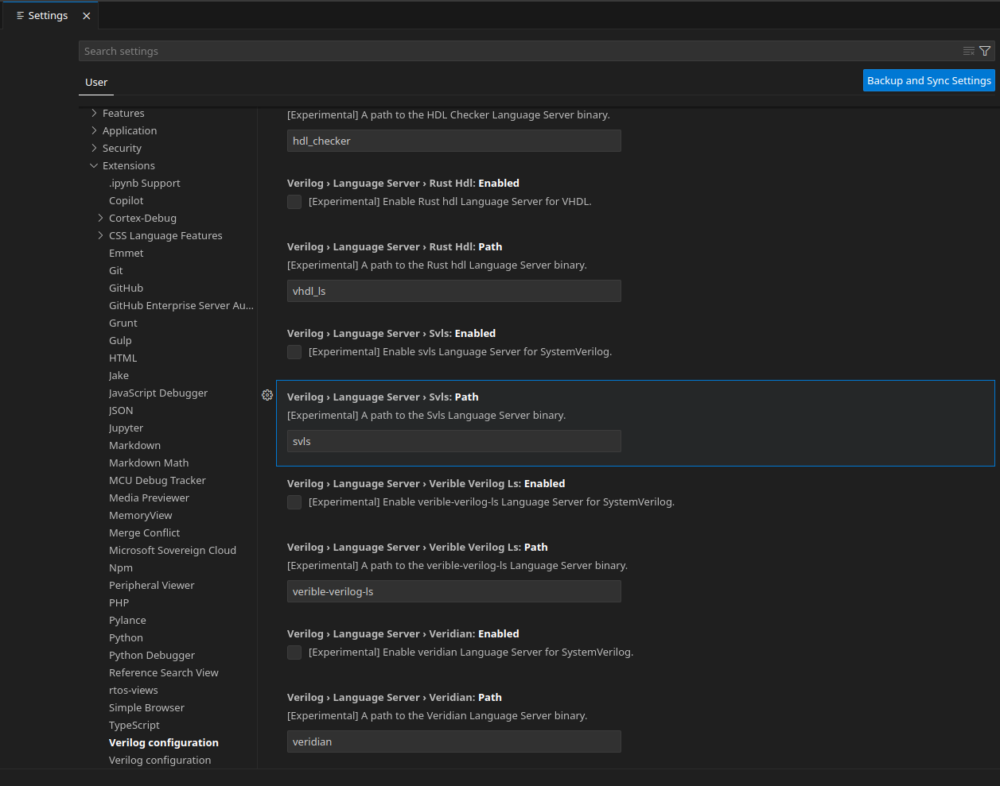
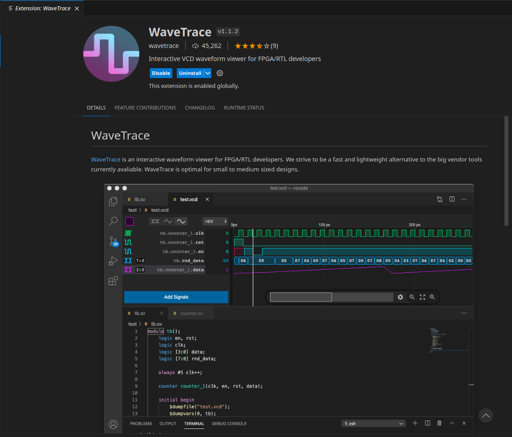
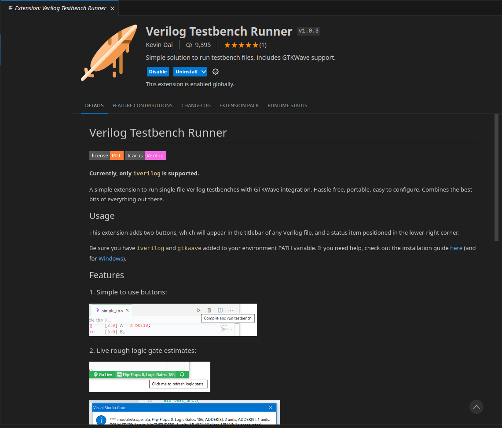

# Icarus-Verilog + расширения VSCode

Это памятка по созданию среды разработки прошивок под FPGA в дистрибутивах GNU Linux. Используемый дистрибутив - Manjaro Linux версии 23.1.1, FPGA board Terasic DE10-Lite Altera MAX10.

## Icarus Verilog
*Icarus Verilog* — компилятор языка описания аппаратуры Verilog. Используется для симуляции и верификации проектов. Для загрузки используем менеджер пакетов Manjaro - *pamac*. В терминале вводим следующую команду:
```
pamac install iverilog
```

## Установка необходимых расширений для VSCode   

### Verilog-HDL/SystemVerilog/Bluespec SystemVerilog

Для комфортной работы с Verilog нам потребуется расширение, обеспечивающее подсветку синтаксиса языка, форматирование, linting и snippets. Будем использовать **Verilog-HDL/SystemVerilog/Bluespec SystemVerilog** оно не единственное возможное и требует несколько сторонних программ для работы, но это лучшее из того что есть на сегодняшний день. Скачиваем его прямо из *marketplace* в *VSCode*:

  

Далее установим набор сторонних программ требующихся для работы расширения и произведем настройку. Настройки, которые <u>необходимо</u> применить в панели **Settings** -> **Extensions** будут помечаться следующим образом:

> **Attention:** *настройки* - **Применяемые параметры**

Открыть панель **Settings** на пункте **Extensions** можно сочетанием клавиш *Ctrl + ,*
на английской раскладке. Или перейти во вкладку **File** -> **Preference** -> **Settings** -> **Extensions**.

#### Syntax Highlighting  
Поддерживается подсветка синтаксиса для:
- Verilog-HDL
- SystemVerilog
- Bluespec SystemVerilog
- VHDL
- Vivado UCF constraints
- Synopsys Design Constraints
- Verilog Filelists (dot-F files)
- Tcl

#### Formatting  
Сtags. Он даст минимальный autocomplete. Загружаем:
```
pamac install ctags 
```

#### Linting  
> **Attention:** *Verilog › Linting › Iverilog: Run At File Location* - **Поставить галочку**

  

**Verilog › Linting: Linter** - **iverilog**
  


#### Snippets 
языковой сервер svls. Добавит предупреждений на кривом коде
Для загрузки используем помощник *Aur* - *yay*
```
yay -S svls
```

> **Attention:** *Verilog: Language Server* - **svls**

  

### WaveTrace
  

### Verilog Testbench Runner
  