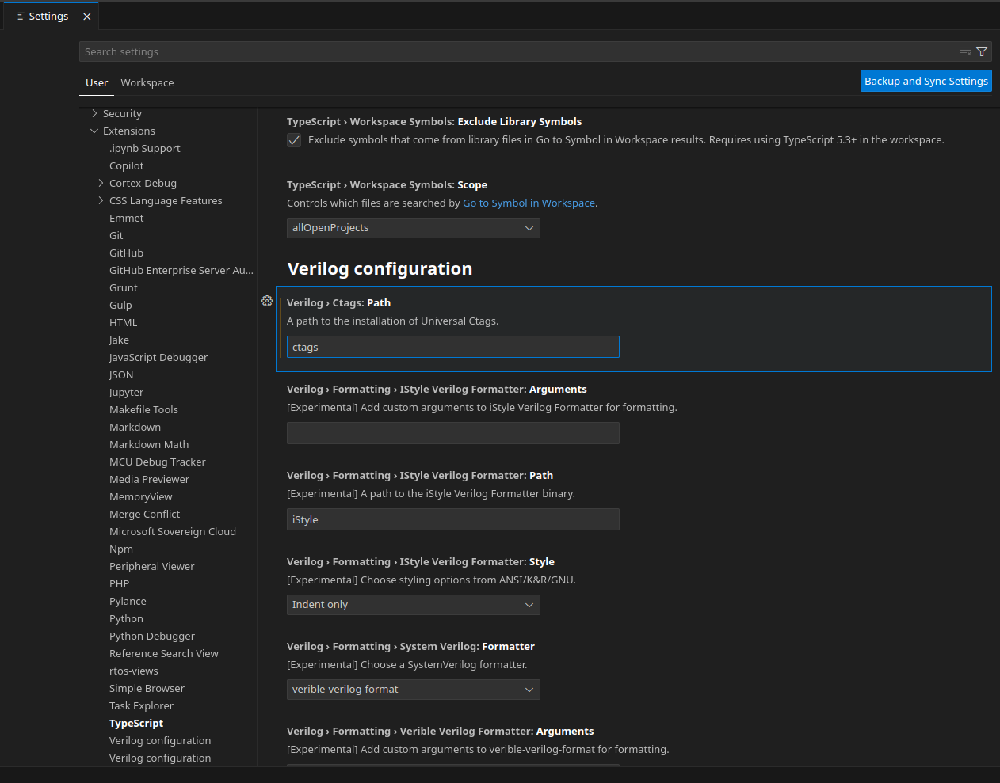
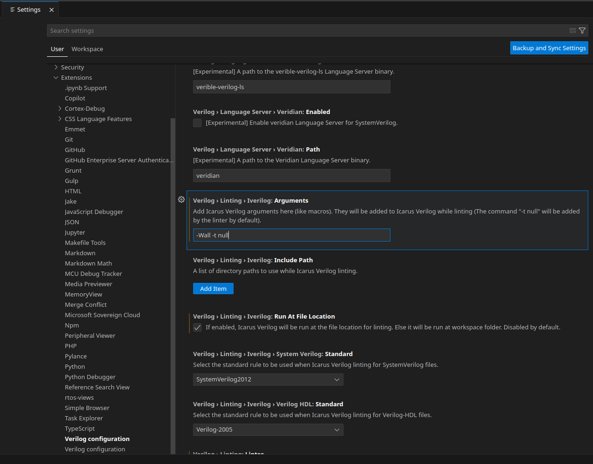

# Icarus-Verilog + расширения VSCode

Это памятка по созданию среды разработки прошивок под FPGA в дистрибутивах GNU Linux. Используемый дистрибутив - Manjaro Linux версии 23.1.1, FPGA board Terasic DE10-Lite Altera MAX10.

## Icarus Verilog  
*Icarus Verilog* — компилятор языка описания аппаратуры Verilog. Используется для симуляции и верификации проектов. Для загрузки используем менеджер пакетов Manjaro - *pamac*. В терминале вводим следующую команду:
```
pamac install iverilog
```
[Документация](https://steveicarus.github.io/iverilog/index.html) на *Icarus Verilog*

## Установка необходимых расширений для VSCode

### Verilog-HDL/SystemVerilog/Bluespec SystemVerilog

Для комфортной работы с Verilog нам потребуется расширение, обеспечивающее подсветку синтаксиса языка, форматирование, linting и snippets. Будем использовать **Verilog-HDL/SystemVerilog/Bluespec SystemVerilog** оно не единственное возможное и требует несколько сторонних программ для работы, но это лучшее из того что есть на сегодняшний день. Скачиваем его прямо из *marketplace* в *VSCode*:

  

#### Syntax Highlighting  
Поддерживается подсветка синтаксиса для:
- Verilog-HDL
- SystemVerilog
- Bluespec SystemVerilog
- VHDL
- Vivado UCF constraints
- Synopsys Design Constraints
- Verilog Filelists (dot-F files)
- Tcl

Далее установим набор сторонних программ требующихся для работы расширения и произведем настройку. Настройки, которые <u>необходимо</u> применить в панели **Settings** -> **Extensions** будут помечаться следующим образом:

> **Attention:** *настройки* - **Применяемые параметры**

Открыть панель **Settings** на пункте **Extensions** можно сочетанием клавиш *Ctrl + ,*
на английской раскладке. Или перейти во вкладку **File** -> **Preference** -> **Settings** -> **Extensions**.

> **Attention:** *Verilog › Logging: Enabled* - **YES**

#### Сtags
  
Сtags даст автозаполнение, переход к определению и его просмотра, инстраляцию модулей и некоторые другие возможности. Загружаем:
```
pamac install ctags 
```

Проверям наличие *PATH environment*:
> **Attention:** *Verilog › Ctags: Path* - **ctags**




Добавляем следующие настройки в *.vscode/settings.json* в нашу рабочую область.
```json
{
    "ctags-companion.command": "ctags -R --fields=+nKz -f .vscode/.tags --langmap=SystemVerilog:+.v -R rtl /opt/uvm-1.2/src",
    "ctags-companion.readtagsEnabled": true,
}
```
Это нужно, чтобы поиск осуществлялся не только в рабочей области, но и в файлах за ее пределами (например, */opt/uvm-1.2/src* в примере выше). А readtags, позволит осуществлять быстрый поиск в больших рабочих пространствах.

#### Linting  
Линтинг — это автоматизированный процесс анализа кода и поиска потенциальных ошибок. Помимо поиска ошибок, линтер во многих случаях может исправить те самые ошибки автоматически.

Выбираем линтер:
> **Attention:** *Verilog › Linting: Linter* - **iverilog**

  


В Icarus Verilog можно указать собственные аргументы для проверки, например *-Wall*.
> **Attention:** *Verilog › Linting › Iverilog: Arguments* - **-Wall**

  


Список путей к директориям, которые будут использоваться при проверке *Icarus Verilog linting*.
> **Attention:** Verilog › Linting › Iverilog: Include Path - **-I <directory_path>**


По умолчанию линтер будет запускаться в каталоге рабочей области. Если включить эту опцию, то линтер будет запускаться из места, где находится файл для проверки. Важный момент, если подключены директивы include, то они должны содержать пути к файлам относительно файла для проверки.
> **Attention:** *Verilog › Linting › Iverilog: Run At File Location* - **Поставить галочку**

  


#### Language Server 
Языковой сервер - это специальная программа, работающая на сервере. Он принимает мета-состояние редактора и возвращает набор действий или инструкций. Используем языковой сервер svls, он будет уведомлять наш редактор об обнаруженных ошибках и предупреждениях.
Для загрузки используем помощник *Aur* - *yay*
```
yay -S svls
```

Проверям наличие *PATH environment*:
> **Attention:** *Verilog › Language Server › Svls: Path* - **svls**

  


Выбираем языковой сервер:
> **Attention:** *Verilog: Language Server* - **svls**

  

### WaveTrace
  

### Verilog Testbench Runner
  